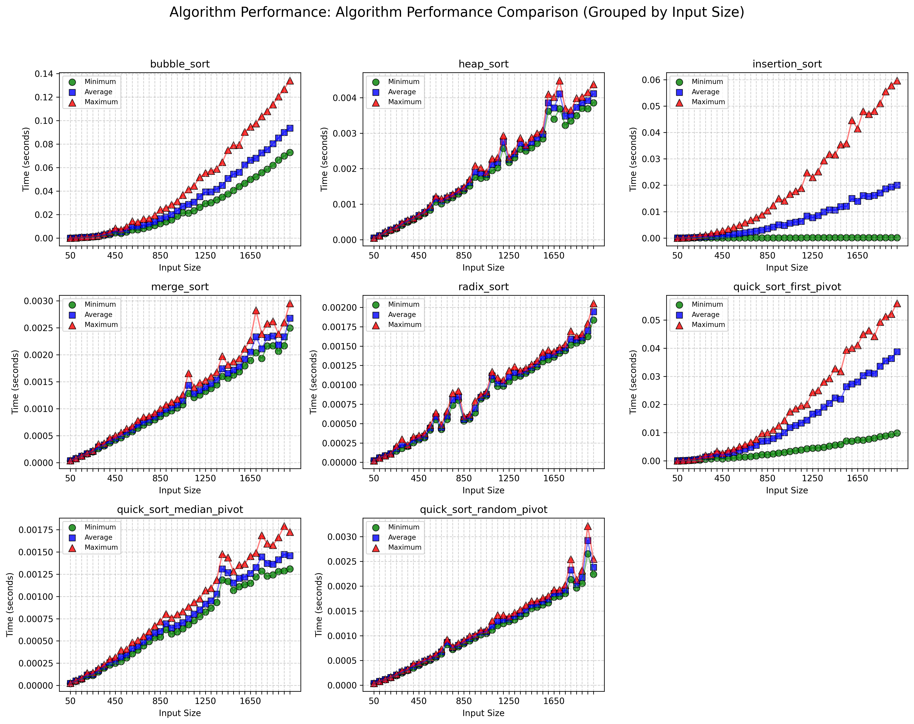
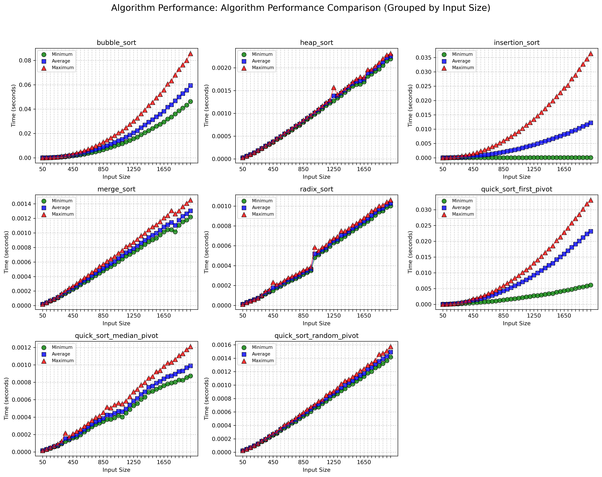

# Sorting Algorithms Analysis

This repository contains implementations and analysis of various sorting algorithms as part of a Data Structures and Algorithms assignment.

## Overview

This project implements and analyzes the performance of six different sorting algorithms:

- Bubble Sort
- Insertion Sort
- Heap Sort
- Merge Sort
- Quick Sort
- Radix Sort

## Getting Started

### Prerequisites

- Python 3.x
- Required Python packages (install using `pip install -r requirements.txt`)

### Running the Experiments

Generate testcases:

```bash
python utils/Test_Generator.py
```

To run the complete set of experiments:

```bash
python run.py
```

This will:

1. Load test data
2. Run all sorting algorithms on the test data
3. Measure and record execution times
4. Generate performance comparison graphs

## Implemented Sorting Algorithms

### Bubble Sort

- **Time Complexity**: O(n²)
- **Space Complexity**: O(1)
- Implementation: [algorithms/bubble_sort.py](algorithms/bubble_sort.py)

### Insertion Sort

- **Time Complexity**: O(n²)
- **Space Complexity**: O(1)
- Implementation: [algorithms/insert_sort.py](algorithms/insert_sort.py)

### Heap Sort

- **Time Complexity**: O(n log n)
- **Space Complexity**: O(1)
- Implementation: [algorithms/heap_sort.py](algorithms/heap_sort.py)

### Merge Sort

- **Time Complexity**: O(n log n)
- **Space Complexity**: O(n)
- Implementation: [algorithms/merge_sort.py](algorithms/merge_sort.py)

### Quick Sort

- **Time Complexity**: O(n log n) average, O(n²) worst case
- **Space Complexity**: O(log n)
- Implementation: [algorithms/quick_sort.py](algorithms/quick_sort.py)

### Radix Sort

- **Time Complexity**: O(nk) where k is the number of digits
- **Space Complexity**: O(n+k)
- Implementation: [algorithms/radix_sort.py](algorithms/radix_sort.py)

## Experimental Results

The repository includes experimental results comparing the performance of different sorting algorithms across various input sizes and types. The results are visualized in the following graphs:


_[View detailed results for Experiment 1](outputs/experiment1.txt)_


_[View detailed results for Experiment 2](outputs/experiment2.txt)_

## Utilities

- [utils/load_testcases.py](utils/load_testcases.py) - Functions to load test data from files
- [utils/plot_graph.py](utils/plot_graph.py) - Functions to generate performance comparison graphs
- [utils/run_experiment.py](utils/run_experiment.py) - Script to automate experiment execution
- [utils/Test_Generator.py](utils/Test_Generator.py) - Generate test cases with different properties
